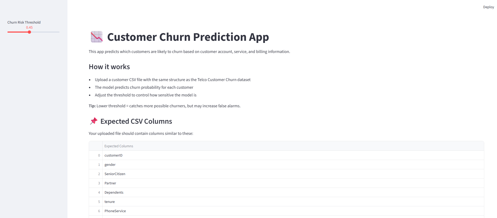
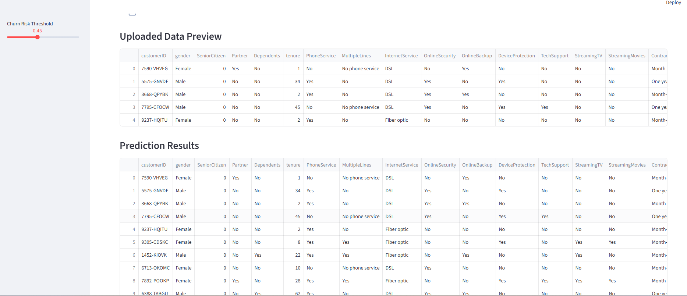

# 📉 Customer Churn Prediction App

## 🚀 Overview

This project is a machine learning-powered customer churn prediction app built with Streamlit.

It allows users to upload customer data and identify which customers are likely to churn, along with churn probability scores.

The goal is to help businesses take proactive retention actions before losing valuable customers.

---

## 🎯 Problem Statement

Customer churn is a major challenge for subscription-based businesses such as telecoms, SaaS companies, banks, and digital platforms.

This project answers:

> Which customers are most likely to leave?

---

## 🧠 What This App Does

- Upload customer CSV data
- Preprocess customer features
- Predict churn risk
- Generate churn probability scores
- Highlight high-risk customers
- Show top factors driving churn
- Download prediction results

---

## 🛠️ Tech Stack

- Python
- pandas
- scikit-learn
- Streamlit
- joblib

---

## 🤖 Machine Learning Approach

The model is trained using a Random Forest Classifier.

Key steps:

- Data cleaning
- Categorical encoding
- Feature alignment for uploaded data
- Model training
- Probability-based churn prediction
- Threshold tuning for risk sensitivity

---

## 📊 Model Performance

Baseline model performance:

- Accuracy: ~80%
- Churn recall improved using class balancing and threshold adjustment

The model is optimized to support business decision-making by identifying more at-risk customers.

---

## 📸 Demo Screenshots

### App Interface


### Prediction Results


## 📂 Expected Dataset Format

The app expects customer data similar to the Telco Customer Churn dataset.

Expected columns include:

```text
customerID
gender
SeniorCitizen
Partner
Dependents
tenure
PhoneService
MultipleLines
InternetService
OnlineSecurity
OnlineBackup
DeviceProtection
TechSupport
StreamingTV
StreamingMovies
Contract
PaperlessBilling
PaymentMethod
MonthlyCharges
TotalCharges

The uploaded file may include a Churn column, but it is not required for prediction.

---

##  🖥️ Streamlit App Features
CSV upload
Churn prediction table
Churn probability score
High-risk customer list
Churn rate metrics
Feature importance chart
Downloadable prediction CSV

---
🚀 How to Run Locally
1. Clone the repository
git clone https://github.com/TheOrthman/customer-churn-prediction-app/tree/main
cd customer-churn-prediction-app
2. Install dependencies
pip install -r requirements.txt
3. Run the app
python -m streamlit run app.py

---
📂 Project Structure
customer-churn-prediction-app/
│
├── app.py
├── README.md
├── requirements.txt
├── .gitignore
│
├── src/
│   └── preprocess.py
│
├── models/
│   ├── churn_model.pkl
│   └── model_features.pkl
│
├── data/
│   └── churn.csv
│
└── images/
    └── app_screenshot.png

---

💡 Business Impact

This app can help businesses:

Identify customers likely to leave
Prioritize retention efforts
Reduce revenue loss
Improve customer relationship management
Support data-driven decision-making
📌 Key Learnings
Churn prediction is more useful when optimized for recall
Probability thresholds allow businesses to control risk sensitivity
Feature alignment is important when building reusable ML apps
A model becomes more valuable when deployed as an interactive tool

---
🔮 Future Improvements
Deploy on Streamlit Cloud
Add customer segmentation
Add SHAP explainability
Add retention recommendation engine
Connect to live CRM/customer databases
⚠️ Disclaimer

This project is for educational and portfolio purposes.
Predictions should be validated with business context before making customer decisions.

👤 TheOrthmaan-- Author

Built as part of a data analytics and machine learning portfolio.
